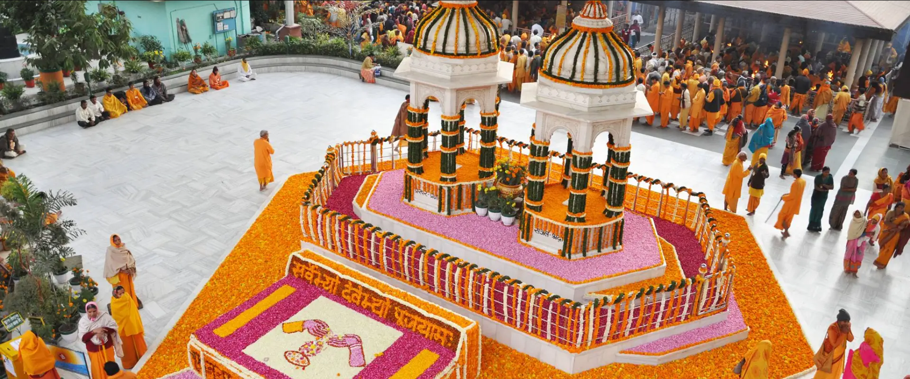

<div align="center">
  

  <h1>AWGP Bengaluru</h1>

  <p><strong>The official website of All World Gayatri Pariwar, Bengaluru — a fully trilingual (English · हिन्दी · ಕನ್ನಡ) spiritual and community platform built on the Next.js App Router, with a JSON-driven content model, a lightweight admin CMS, and an SEO layer engineered for local search.</strong></p>

  <p>
    
    
    
    
    
    
  </p>

  <sub><em>Hum Badlenge — Yug Badlega</em> · We change, the era changes.</sub>
</div>

---

## About

AWGP Bengaluru is a branch of **All World Gayatri Pariwar** (Shantikunj, Haridwar), based in Begur, Bengaluru. The centre runs sanskars, yagya, yoga, dhyan, lectures and workshops, alongside community work — tree plantation, book exhibitions, food and cloth distribution, and health camps.

This repository is the centre's public web presence. It is not a brochure site bolted together from a template: it is a content platform. Editors update the site through a password-protected admin panel that writes JSON; every page renders in three languages; and the whole thing is wired for local SEO so that searches like *"Gayatri Pariwar Bangalore"* or *"Gayatri Chetna Kendra Bengaluru"* resolve to this centre.

> **Why trilingual, first-class?** The audience spans Hindi-speaking devotees, Kannada-speaking locals, and an English-reading diaspora. Language is not an afterthought here — every route is locale-prefixed (`/en`, `/hi`, `/kn`), content lives in per-locale JSON, and `hreflang` alternates tell Google exactly which version to serve to whom.

---

## Highlights

| Capability | Where it lives |
|------------|----------------|
| **Trilingual routing** — `/en`, `/hi`, `/kn` on every page, `hreflang` alternates | `middleware.js` · `lib/i18n/` · `messages/{en,hi,kn}.json` |
| **JSON-driven content** — pages read from data, not hardcoded JSX | `data-json-files/` · `data/` · `lib/content.js` |
| **Admin CMS** — session-gated editor that reads/writes section JSON | `app/admin/` · `app/api/content/[section]/` |
| **SEO system** — one config → metadata, JSON-LD, sitemap, robots, FAQ schema | `lib/seo/` · `components/seo/` · `app/sitemap.js` · `app/robots.js` |
| **Four spiritual pillars** — Sadhana · Swadhyay · Sanyam · Seva | `app/[locale]/{sadhana,swadhyay,sanyam,seva}/` · `components/pillars/PillarPage.jsx` |
| **Sanskars** — 10 life-ceremony guides, index grid + detail pages | `app/[locale]/sanskars/` · `data-json-files/sanskars/` |
| **Activities & programs** — yoga, workshops, meditation, gau-seva, festivals | `app/[locale]/activities/` · `app/[locale]/programs/` |
| **Media** — photo gallery + news, auto-generated from folders | `lib/galleryManifest.js` · `lib/photoManifest.js` · `scripts/` |
| **Privacy-friendly analytics** — first-party visitor tracking, no third party | `lib/analytics.js` · `app/api/track/` · `app/admin/analytics/` |

---

## Preview

<table>
  <tr>
    <td width="50%"></td>
    <td width="50%"></td>
  </tr>
  <tr>
    <td><strong>Home</strong> — hero, pillars, programs, highlights, gallery, FAQ</td>
    <td><strong>About</strong> — mission, lineage, and the Gayatri Chetna Kendra</td>
  </tr>
</table>

> Screenshots above use existing hero assets. Drop dedicated screenshots into `public/screenshots/` and swap the paths if you want a richer gallery.

---

## Architecture

```
┌─────────────────────────────────────────────────────────────────┐
│                        REQUEST (middleware.js)                    │
│  /admin/*  → iron-session auth gate (redirect to /admin/login)   │
│  /*        → next-intl locale routing  (/en · /hi · /kn)         │
└───────────────┬─────────────────────────────────┬───────────────┘
                ▼                                   ▼
┌───────────────────────────────┐   ┌───────────────────────────────┐
│        PUBLIC SITE            │   │          ADMIN CMS             │
│  app/[locale]/*  (29 routes) │   │  app/admin/*  (session-gated)  │
│  Server Components + CSS      │   │  Section editor UI             │
│  Pillars · Sanskars ·        │   │  Analytics dashboard           │
│  Activities · Programs ·     │   └───────────────┬────────────────┘
│  Blog · Media · Contact      │                   │ POST
└───────────────┬──────────────┘                   ▼
                │ read                ┌───────────────────────────────┐
                ▼                     │        API ROUTES             │
┌───────────────────────────────┐    │  auth/login · auth/logout     │
│        CONTENT LAYER          │◀───│  content/[section] (GET/POST) │
│  data-json-files/ · data/     │    │  track (visitor pings)        │
│  lib/content.js               │    └───────────────────────────────┘
│  messages/{en,hi,kn}.json     │
└───────────────┬───────────────┘
                ▼
┌───────────────────────────────┐
│          SEO LAYER            │
│  lib/seo/siteConfig.js  ─────▶ metadata · JSON-LD · sitemap ·     │
│  (single source of truth)      robots · hreflang · FAQ schema     │
└───────────────────────────────┘
```

**Design choices worth calling out:**

- **Locale routing in middleware, auth in the same pass.** `middleware.js` short-circuits `/admin` for a session check and hands everything else to `next-intl`. One entry point, two concerns, no overlap — admin routes never carry a locale prefix, public routes always do.
- **Content is data, not code.** Pages read from `data-json-files/` and `data/` via `lib/content.js`. Editors change JSON — through the admin panel or directly — and the site updates without a code deploy touching JSX.
- **One SEO source of truth.** `lib/seo/siteConfig.js` holds the NAP (name/address/phone), geo, founders, and parent-org facts. Metadata, structured data, the sitemap and robots all read from it, so a citation change happens in exactly one place.
- **`public/` excluded from the serverless trace.** Server components read photo folders at build time; without `outputFileTracingExcludes`, Next would bundle the entire ~430 MB `public/` tree into each function and blow past Vercel's 250 MB limit. Images are served from the CDN, never from a function.

---

## Content Model

Content is split by concern and, where it is user-facing prose, by locale:

| Source | Holds | Edited via |
|--------|-------|-----------|
| `messages/{en,hi,kn}.json` | UI strings, labels, navigation | Translators / direct edit |
| `data-json-files/about/` (en/hi/kn) | About, Initiatives, Chetna Kendra pages | Admin CMS / JSON |
| `data-json-files/sanskars/sanskars.json` | 10 sanskar guides (index + detail) | JSON |
| `data-json-files/{sadhana,swadhyay,sanyam,seva}.json` | The four pillar pages | JSON |
| `data/{blog,news,programs,activities,schedule}.json` | Dynamic listings | Admin CMS / JSON |
| `data/analytics.json` | First-party visit counters | Written by `/api/track` |

The admin editor (`app/admin/[section]`) posts to `app/api/content/[section]/route.js`, which validates and writes the corresponding JSON through `lib/content.js`.

---

## Quick Start

**Prerequisites:** Node.js 18+ · npm

```bash
# 1. Install dependencies
npm install

# 2. Configure environment — create .env.local (see "Environment variables" below)

# 3. Run the dev server (Turbopack)
npm run dev
```

| Task | Command |
|------|---------|
| Dev server (Turbopack) | `npm run dev` |
| Production build | `npm run build` |
| Start production server | `npm run start` |
| Lint | `npm run lint` |

Open **http://localhost:3000** — you'll be redirected to `/en`. The admin panel lives at **/admin** (login at **/admin/login**).

> `npm run build` runs a `prebuild` step (`scripts/gen-photo-manifest.mjs`) that scans `public/assets/…` and regenerates the photo manifest so galleries stay in sync with the files on disk.

### Environment variables

Create `.env.local` in the project root:

```ini
# Admin credentials (change before deploying!)
ADMIN_PASSWORD=your-strong-password

# Session signing key — must be at least 32 characters
SESSION_SECRET=replace-with-a-long-random-32char-string

# Optional — override the canonical origin for staging/preview builds
NEXT_PUBLIC_SITE_URL=https://www.awgpblr.org

# Optional — Google Search Console verification token
NEXT_PUBLIC_GOOGLE_SITE_VERIFICATION=
```

---

## Project Structure

```
awgp-next-snapshot/
├── app/
│   ├── layout.jsx                 # Root layout
│   ├── sitemap.js · robots.js     # Auto-generated from lib/seo
│   ├── [locale]/                  # Public site — one folder per route
│   │   ├── page.jsx               # Home
│   │   ├── about · initiatives · chetna-kendra
│   │   ├── sadhana · swadhyay · sanyam · seva     # The four pillars
│   │   ├── sanskars/[slug]        # Sanskar index + detail
│   │   ├── activities/…           # yoga, workshops, meditation, gau-seva, …
│   │   ├── programs/[slug] · programs/festivals
│   │   ├── blog/[slug] · media/gallery · media/news
│   │   └── literature · contact
│   ├── admin/                     # Session-gated CMS + analytics
│   └── api/                       # auth · content · track
│
├── components/
│   ├── sections/                  # Home + page sections (39 components)
│   ├── pillars/PillarPage.jsx     # Shared pillar template
│   ├── activities/ · initiatives/ · layout/ · ui/
│   └── seo/                       # JsonLd, Breadcrumbs, FaqSection
│
├── lib/
│   ├── i18n/                      # routing · request · navigation
│   ├── seo/                       # siteConfig · metadata · schema · faqs
│   ├── content.js                 # JSON read/write for the CMS
│   ├── analytics.js               # First-party visit counters
│   ├── galleryManifest.js · photoManifest.js · highlights.js
│
├── data-json-files/               # Locale-aware page content (en/hi/kn)
├── data/                          # Dynamic listings + analytics store
├── messages/                      # UI strings — en.json · hi.json · kn.json
├── scripts/                       # gen-photo-manifest · gen-gallery-manifest
├── public/assets/                 # Images, logos, highlights (CDN-served)
├── docs/                          # Brand spec, design system, SEO, guides
├── middleware.js                  # Locale routing + admin auth
└── next.config.mjs
```

---

## Tech Stack

| Layer | Choice | Why |
|-------|--------|-----|
| Framework | **Next.js 15** (App Router, Turbopack) | Server Components, file-based routing, fast HMR in dev |
| UI | **React 19** | Latest concurrent features; server-first components |
| i18n | **next-intl** | Locale-prefixed routing, per-locale messages, `hreflang` |
| Styling | **Tailwind CSS v4** + scoped CSS | Utility-first with per-component CSS for bespoke sections |
| Auth | **iron-session** | Stateless, cookie-based admin sessions — no DB required |
| Icons | **lucide-react** · **react-icons** | Consistent, tree-shakeable icon sets |
| Content | **File-based JSON** | Zero-infra CMS; edits are diffable and version-controlled |
| Analytics | **First-party** (`/api/track`) | Privacy-friendly, no third-party trackers |

---

## Documentation

| Doc | Purpose |
|-----|---------|
| [`docs/awgp-bengaluru-brand-concept-spec.md`](docs/awgp-bengaluru-brand-concept-spec.md) | Brand concept and voice |
| [`docs/design-system.md`](docs/design-system.md) | Colours, type, components |
| [`docs/pillar-pages-image-guide.md`](docs/pillar-pages-image-guide.md) | How to drop images into the pillar pages |
| [`docs/seo/`](docs/seo/) | SEO assumptions, launch checklist, off-site citations |

---

## Pre-Launch Checklist

- [ ] Set a strong `ADMIN_PASSWORD` and a 32+ char `SESSION_SECRET` in production.
- [ ] Confirm `NEXT_PUBLIC_SITE_URL` matches Search Console + the Google Business Profile (www vs non-www).
- [ ] Replace the approximate geo-coordinates in `lib/seo/siteConfig.js` with the exact Business Profile pin.
- [ ] Add the `NEXT_PUBLIC_GOOGLE_SITE_VERIFICATION` token.
- [ ] Verify NAP (name/address/phone) is identical here and in every off-site citation.

---

## License

Project maintained for **All World Gayatri Pariwar, Bengaluru**. Content, imagery, and branding belong to the organisation. Not for redistribution without permission.
